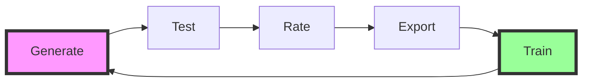

<h1 align="center">🔬 circuitry-forge</h1>

<p align="center">
  <em>The first self-improving AI safety evaluation ecosystem that gets smarter every day</em>
</p>

<p align="center">
  <a href="#"></a>
  <a href="#"></a>
  <a href="#"></a>
  <a href="#"></a>
</p>


## 🎯 What This Does

**Before circuitry-forge:**
- ❌ Manual safety test writing (hours per scenario)
- ❌ Inconsistent evaluation coverage
- ❌ No learning from what works
- ❌ Siloed safety research

**After circuitry-forge:**
- ✅ AI generates scenarios in seconds
- ✅ Systematic safety evaluation
- ✅ Self-improving feedback loop
- ✅ Shared safety ecosystem

## ⚡ Quick Start

```bash
# Quick demo with UV (recommended)
git clone https://github.com/circuitrylabs/circuitry-forge.git
cd circuitry-forge
uv run scenario-forge generate "ai_psychosis" --save
```

## 🚀 The Strangeloop in Action



1. **Generate** scenarios using local LLMs (no API keys!)
2. **Test** them on AI systems
3. **Rate** which ones found real issues
4. **Export** high-quality scenarios
5. **Train** better models → Back to step 1 🔄

## 🏃 Full Installation

```bash
# Clone and setup
git clone https://github.com/circuitrylabs/circuitry-forge.git
cd circuitry-forge
uv sync

# Generate your first scenario
uv run scenario-forge generate "medical_misinformation" --save

# Review and rate
uv run scenario-forge review

# Export the good ones
uv run scenario-forge export --min-rating 2 > training_data.json
```

## 🌟 Who's Using This

<p align="center">
  <em>Join leading AI safety researchers worldwide</em>
</p>

Join the growing community of AI safety researchers using circuitry-forge to build safer AI systems.

## 📚 Documentation

| I want to... | Start here |
|-------------|------------|
| 🎮 See it work | `uv run scenario-forge generate "example" --save` |
| 🧠 Understand concepts | [How It Works](docs/SCENARIO_FORGE_CORE.md) |
| 🔧 Build with it | [API Reference](docs/ARCHITECTURE.md) |
| 🤝 Contribute | [GitHub Issues](https://github.com/circuitrylabs/circuitry-forge/issues) |
| 🚀 See the roadmap | [Mission & Vision](docs/MISSION_VISION.md) |

## 🏗️ Architecture

```
circuitry-forge/
├── scenario-forge/    # Generate test scenarios (you are here)
├── prism-forge/       # Extract model patterns (coming soon)
└── model-forge/       # Fine-tune safety models (planned)
```

## 🔒 Safety & Trust

- 🛡️ **Safety-first**: Every scenario evaluates FOR safety, never teaches harm
- 🔍 **100% open source**: Audit every line of code
- 🏠 **Local-first**: Default Ollama backend, no data leaves your machine
- 📊 **75%+ test coverage**: Rigorous quality standards
- 🤝 **Transparent process**: Open development, open data

## 🧪 Development

### Prerequisites
- Python 3.13+
- [UV](https://docs.astral.sh/uv/) package manager
- [Ollama](https://ollama.com/) for local inference

### Commands
```bash
# Run tests
uv run pytest

# Format & lint
uvx ruff format . && uvx ruff check . --fix

# Type check
uvx ty

# Pre-commit check
uv run pytest && uvx ruff format . && uvx ruff check . --fix
```

## 🤝 Contributing

We believe AI safety is too important for any single organization. Join us:

1. 🐛 [Report bugs](https://github.com/circuitrylabs/circuitry-forge/issues)
2. 💡 [Suggest features](https://github.com/circuitrylabs/circuitry-forge/discussions)
3. 🔧 [Submit PRs](https://github.com/circuitrylabs/circuitry-forge/pulls)
4. 📖 [Improve docs](docs/)

See [CONTRIBUTING.md](CONTRIBUTING.md) for guidelines.

## 📈 Roadmap

**Now (v0.1.0-rc1)** ✅
- Core generation with Ollama
- Review & rating system
- JSON/CSV export

**Next (v0.2.0)**
- HuggingFace integration
- Multi-backend support (OpenAI, Anthropic)
- Advanced filtering

**Future (v1.0.0)**
- Self-improvement automation
- Domain-specific models
- Enterprise features

See [full roadmap](docs/MISSION_VISION.md)

## 📜 License

MIT License - see [LICENSE](LICENSE)

## 💬 Community

- 📦 [GitHub Repository](https://github.com/circuitrylabs/circuitry-forge)
- 🐛 [Issues & Feedback](https://github.com/circuitrylabs/circuitry-forge/issues)
- 📖 [Documentation](https://github.com/circuitrylabs/circuitry-forge/tree/main/docs)

---

<p align="center">
  <strong>Together, we make AI safe for everyone.</strong>
  <br>
  <br>
  Built with ❤️ by the Circuitry Labs team
</p>